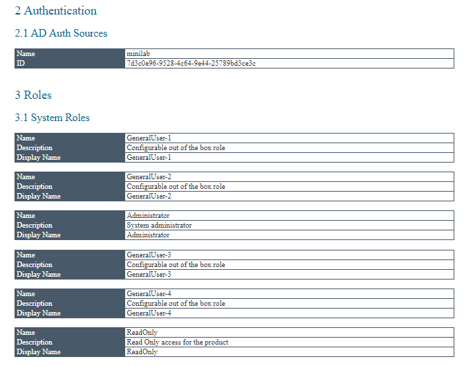
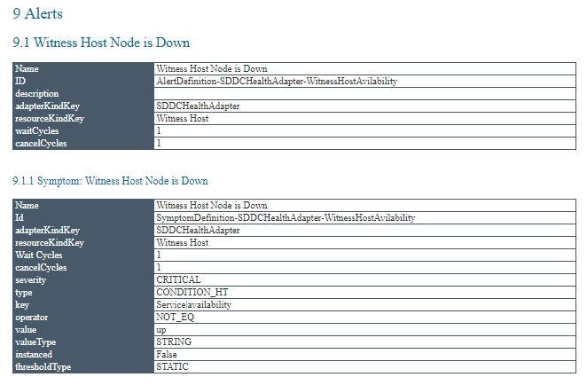
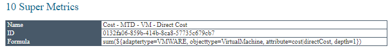
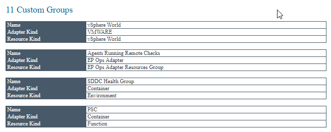

# VMware vROps As Built Report

# Getting Started
Below are the instructions on how to install, configure and generate a VMware vROps As Built report.

## Pre-requisites
The following PowerShell modules are required for generating a VMware vROps As Built report.

Each of these modules can be easily downloaded and installed via the PowerShell Gallery 

- [AsBuiltReport Module](https://www.powershellgallery.com/packages/AsBuiltReport/)
- [VMware PowerCLI Module](https://www.powershellgallery.com/packages/VMware.PowerCLI/)
- [PowervROPs Module](https://github.com/ymmit85/PowervROps/)

### Module Installation

Open a Windows PowerShell terminal window and install each of the required modules as follows;
```powershell
install-module AsBuiltReport
install-module VMware.PowerCLI
```
### PowervROPs Installation

Open a Windows PowerShell terminal window and pull the latest version of PowervROps from Github.

```powershell
git clone https://github.com/ymmit85/powervrops.git
import-module \PowervROps\PowervROPs.psm1
```

### Required Privileges

To generate a VMware vROps report, a user account with Read-Only rights to all objects within vROps. Ideally a Local User Account is used.

## Configuration
The vROps As Built Report utilises a JSON file to allow configuration of report information, options, detail and healthchecks. 

A vROps report configuration file can be generated by executing the following command;
```powershell
New-AsBuiltReportConfig -Report VMware.vROps -Path <User specified folder> -Name <Optional> 
```

Executing this command will copy the default vROps report JSON configuration to a user specified folder. 

All report settings can then be configured via the JSON file.

The following provides information of how to configure each schema within the report's JSON file.

### Report
The **Report** sub-schema provides configuration of the vSphere report information

| Schema | Sub-Schema | Description |
| ------ | ---------- | ----------- |
| Report | Name | The name of the As Built Report
| Report | Version | The report version
| Report | Status | The report release status

### Options
The **Options** sub-schema allows certain options within the report to be toggled on or off

| Schema | Sub-Schema | Setting | Description |
| ------ | ---------- | ------- | ----------- |
| Options | AuthSource | Local/Authentication Source Name | Set location of where to authenticate user running report.
| Options | AlertFilter | String value | Used to report only on Alerts with specified value in name.


### InfoLevel
The **InfoLevel** sub-schema allows configuration of each section of the report at a granular level. The following sections can be set

| Schema | Sub-Schema | Default Setting |
| ------ | ---------- | --------------- |
| InfoLevel | Authentication | 3
| InfoLevel | Roles | 3
| InfoLevel | Groups | 3
| InfoLevel | Users | 3
| InfoLevel | Adapters | 3
| InfoLevel | RemoteCollectors | 3
| InfoLevel | Alerts | 3
| InfoLevel | Symptoms | 3
| InfoLevel | SuperMetrics | 3
| InfoLevel | ServiceStatus | 3
| InfoLevel | CustomGroups | 3

There are 4 levels (0-3) of detail granularity for each section as follows;

| Setting | InfoLevel | Description |
| ------- | ---- | ----------- |
| 0 | Disabled | does not collect or display any information
| 1 | Summary** | provides summarised information for a collection of objects
| 2 | Informative | provides condensed, detailed information for a collection of objects
| 3 | Detailed | provides detailed information for individual objects

\*\* *future release*

### Healthcheck
The **Healthcheck** sub-schema is used to toggle health checks on or off. Currently none configured.

## Examples 
- Generate HTML & Word reports with Timestamp
Generate a vROps As Built Report for vROps Server 'vrops-01.corp.local' using specified credentials. Export report to HTML & DOC formats. Use default report style. Append timestamp to report filename. Save reports to 'C:\Users\Tim\Documents'
```powershell
New-AsBuiltReport -Report VMware.vROps -Target 'vrops-01.corp.local' -Username 'admin' -Password 'VMware1!' -Format Html,Word -OutputPath 'C:\Users\Tim\Documents' -Timestamp
```
- Generate HTML & Text reports with Health Checks
Generate a vROps As Built Report for vROps Server 'vrops-01.corp.local' using stored credentials. Export report to HTML & Text formats. Use default report style. Highlight environment issues within the report. Save reports to 'C:\Users\Tim\Documents'
```powershell
New-AsBuiltReport -Report VMware.vROps -Target 'vrops-01.corp.local' -Credential $Creds -Format Html,Text -OutputPath 'C:\Users\Tim\Documents' -EnableHealthCheck
```
- Generate report with multiple vROps Servers using Custom Style
Generate a single vROps As Built Report for vROps Servers 'vrops-01.corp.local' and 'vrops-02.corp.local' using specified credentials. Report exports to WORD format by default. Apply custom style to the report. Reports are saved to the user profile folder by default.
```powershell
New-AsBuiltReport -Report VMware.vROps -Target 'vrops-01.corp.local','vcenter-02.corp.local' -Username 'admin' -Password 'VMware1!' -StylePath C:\Scripts\Styles\MyCustomStyle.ps1
```
- Generate HTML & Word reports, attach and send reports via e-mail
Generate a vROps As Built Report for vROps Server 'vrops-01.corp.local' using specified credentials. Export report to HTML & DOC formats. Use default report style. Reports are saved to the user profile folder by default. Attach and send reports via e-mail.
```powershell
New-AsBuiltReport -Report VMware.vROps -Target 'vrops-01.corp.local' -Username 'admin' -Password 'VMware1!' -Format Html,Word -OutputPath C:\Users\Tim\Documents -SendEmail
```
## Report Samples

### Authentication Configuration Table


### Alert & Symptom Configuration Table


### Super Metric Configuration Table


### Custom Groups Configuration Table

